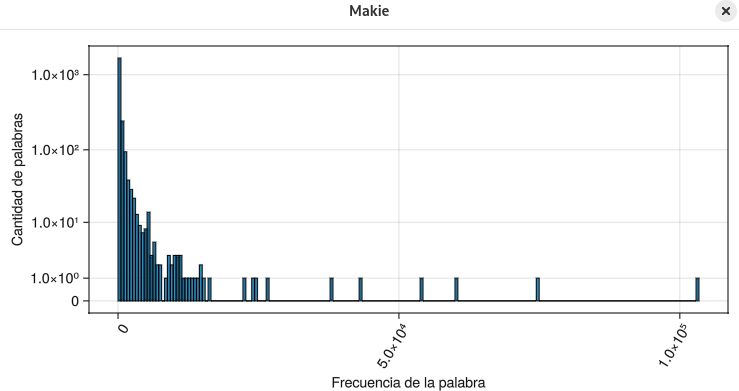
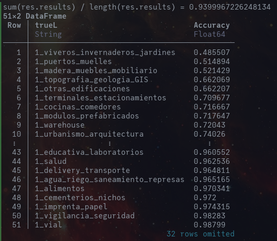

# NLP Procesos de Selección

Clasificación de textos descriptivos en procesos de selección estatales mediante redes neuronales simples.

Los packages clave fueron:
- `DataFrames` (Manejo eficiente de datos tabulares)
- `Flux.jl` (Framework para Machine Learning)
- `TextAnalysis.jl` + `Languages.jl` (NLP)

---

- Las clases menos frecuentes tuvieron un accuracy menor al 80%.
- Las clases más representativas tuvieron un accuracy superior al 90%.

---
Los datos fueron obtenidos del portal [CONOSCE](https://bi.seace.gob.pe/pentaho/api/repos/%3Apublic%3Aportal%3Adatosabiertos.html/content?userid=public&password=key).
